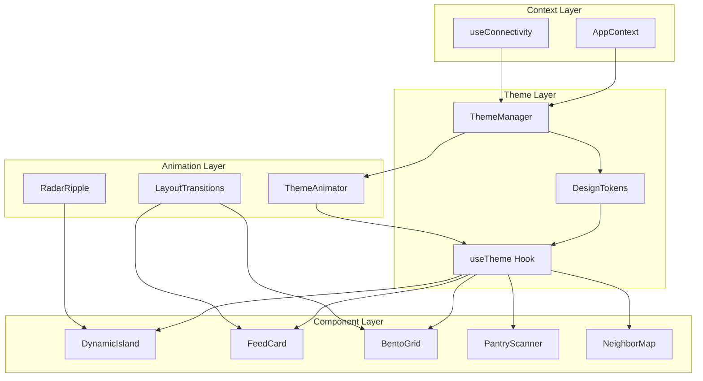
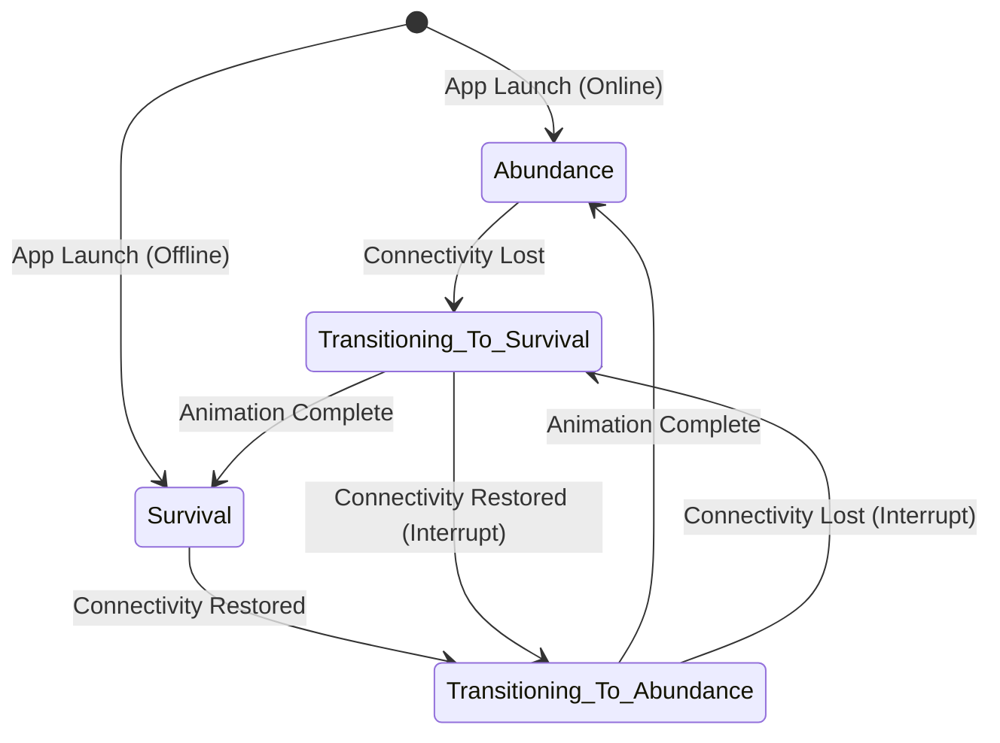
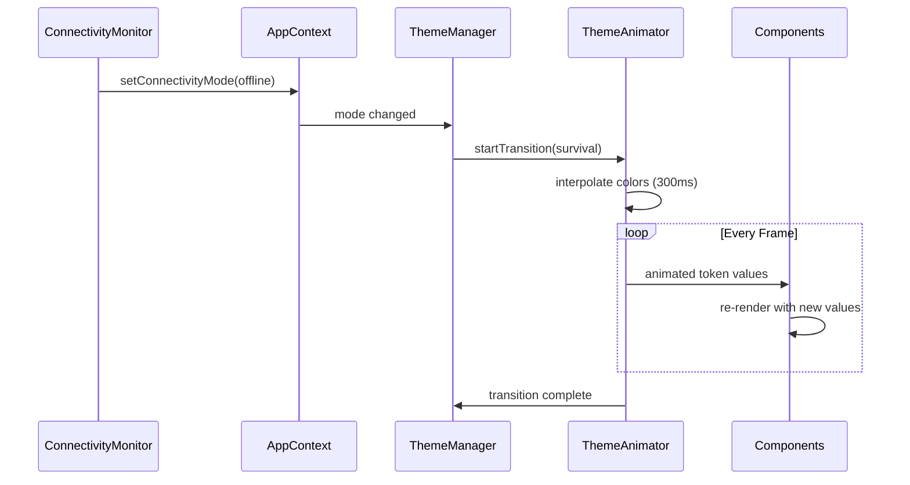

# Design Document: NeighborYield Double Stack UI Overhaul

## Overview

This design document outlines the architecture and implementation approach for the "Double Stack" UI system in the NeighborYield React Native app. The system provides two distinct visual modes—Abundance UI for normal operation and Survival UI for offline/outage scenarios—with smooth animated transitions between them.

The design leverages react-native-reanimated for performant animations, lucide-react-native for consistent iconography, and a token-based theming system that automatically adapts to connectivity state. The architecture prioritizes battery efficiency in Survival mode while delivering a premium visual experience in Abundance mode.

## Architecture

### High-Level Architecture



### Theme State Machine



### Data Flow



## Components and Interfaces

### 1. Design Token System

```typescript
// src/theme/tokens.ts

export interface ColorTokens {
  // Backgrounds
  backgroundPrimary: string;
  backgroundSecondary: string;
  backgroundCard: string;
  backgroundOverlay: string;
  
  // Text
  textPrimary: string;
  textSecondary: string;
  textMuted: string;
  textAccent: string;
  
  // Accents
  accentPrimary: string;
  accentSecondary: string;
  accentSuccess: string;
  accentWarning: string;
  accentDanger: string;
  
  // Borders & Shadows
  borderDefault: string;
  borderFocus: string;
  shadowColor: string;
}

export interface SpacingTokens {
  xs: number;  // 4
  sm: number;  // 8
  md: number;  // 16
  lg: number;  // 24
  xl: number;  // 32
}

export interface TypographyTokens {
  fontFamily: string;
  fontSizeXs: number;
  fontSizeSm: number;
  fontSizeMd: number;
  fontSizeLg: number;
  fontSizeXl: number;
  fontWeightNormal: string;
  fontWeightMedium: string;
  fontWeightBold: string;
}

export interface AnimationTokens {
  durationFast: number;    // 150ms
  durationNormal: number;  // 300ms
  durationSlow: number;    // 500ms
  easingDefault: string;
}

export interface DesignTokens {
  colors: ColorTokens;
  spacing: SpacingTokens;
  typography: TypographyTokens;
  animation: AnimationTokens;
  mode: 'abundance' | 'survival';
}

export const abundanceTokens: ColorTokens = {
  backgroundPrimary: '#F5F9F5',
  backgroundSecondary: '#FFFFFF',
  backgroundCard: '#FFFFFF',
  backgroundOverlay: 'rgba(0, 0, 0, 0.3)',
  textPrimary: '#1A2E1A',
  textSecondary: '#4A5D4A',
  textMuted: '#8A9A8A',
  textAccent: '#2E7D32',
  accentPrimary: '#4CAF50',
  accentSecondary: '#81C784',
  accentSuccess: '#66BB6A',
  accentWarning: '#FFA726',
  accentDanger: '#EF5350',
  borderDefault: '#E0E8E0',
  borderFocus: '#4CAF50',
  shadowColor: 'rgba(0, 0, 0, 0.1)',
};

export const survivalTokens: ColorTokens = {
  backgroundPrimary: '#0A0F0A',
  backgroundSecondary: '#141A14',
  backgroundCard: '#1A221A',
  backgroundOverlay: 'rgba(0, 0, 0, 0.8)',
  textPrimary: '#E8F5E9',
  textSecondary: '#A5D6A7',
  textMuted: '#66BB6A',
  textAccent: '#00E676',
  accentPrimary: '#00E676',
  accentSecondary: '#69F0AE',
  accentSuccess: '#00E676',
  accentWarning: '#FFAB00',
  accentDanger: '#FF5252',
  borderDefault: '#2E4A2E',
  borderFocus: '#00E676',
  shadowColor: 'transparent',
};
```

### 2. Theme Hook Interface

```typescript
// src/theme/useTheme.ts

import { SharedValue } from 'react-native-reanimated';

export interface AnimatedColorTokens {
  backgroundPrimary: SharedValue<string>;
  backgroundSecondary: SharedValue<string>;
  backgroundCard: SharedValue<string>;
  textPrimary: SharedValue<string>;
  textSecondary: SharedValue<string>;
  accentPrimary: SharedValue<string>;
  // ... other animated colors
}

export interface UseThemeResult {
  /** Current theme mode */
  mode: 'abundance' | 'survival';
  
  /** Static token values for current mode */
  tokens: DesignTokens;
  
  /** Animated color values for smooth transitions */
  animatedColors: AnimatedColorTokens;
  
  /** Whether a transition is in progress */
  isTransitioning: boolean;
  
  /** Force a specific mode (for testing/preview) */
  setMode: (mode: 'abundance' | 'survival') => void;
}

export function useTheme(): UseThemeResult;
```

### 3. Dynamic Island Component

```typescript
// src/components/connectivity/DynamicIsland.tsx

import { SharedValue } from 'react-native-reanimated';

export interface DynamicIslandProps {
  /** Current connectivity mode */
  connectivityMode: ConnectivityMode;
  
  /** Number of connected mesh peers */
  peerCount: number;
  
  /** Whether mesh discovery is active */
  isDiscovering: boolean;
  
  /** Callback when tapped in disconnected state */
  onDisconnectedPress?: () => void;
  
  /** Test ID for testing */
  testID?: string;
}

export interface DynamicIslandState {
  expanded: boolean;
  animatedHeight: SharedValue<number>;
  animatedOpacity: SharedValue<number>;
}

// Component renders:
// - Connectivity icon (wifi/mesh/disconnected)
// - Status label
// - Peer count badge (when applicable)
// - Radar ripple animation (when discovering)
```

### 4. Radar Ripple Animation

```typescript
// src/components/animations/RadarRipple.tsx

export interface RadarRippleProps {
  /** Whether the animation is active */
  isActive: boolean;
  
  /** Size of the ripple container */
  size: number;
  
  /** Number of ripple rings */
  ringCount?: number; // default: 3
  
  /** Color of the ripples */
  color?: string;
  
  /** Duration of one ripple cycle in ms */
  duration?: number; // default: 2000
  
  /** Callback when a peer is discovered (for directional highlight) */
  onPeerDiscovered?: (direction: number) => void;
}

// Animation implementation uses:
// - withRepeat for continuous animation
// - withSequence for staggered ring timing
// - useAnimatedStyle for each ring
// - interpolate for scale and opacity
```

### 5. Dual-Mode Feed Card

```typescript
// src/components/feed/DualModeFeedCard.tsx

export interface DualModeFeedCardProps {
  /** The post data to display */
  post: SharePost;
  
  /** Current theme mode */
  mode: 'abundance' | 'survival';
  
  /** Card size for Bento Grid */
  size: 'small' | 'wide' | 'tall' | 'featured';
  
  /** Interest button state */
  interestState: InterestButtonState;
  
  /** Callback when interest button pressed */
  onInterestPress: (postId: string) => void;
  
  /** Current time for TTL calculations */
  currentTime?: number;
}

// Abundance mode features:
// - Rich imagery (if available)
// - Soft shadows and rounded corners (12px)
// - Full description text
// - Gradient overlays

// Survival mode features:
// - Lucide icon based on category
// - Sharp corners (2px)
// - Compact layout
// - High contrast borders
// - No shadows
```

### 6. Bento Grid Layout

```typescript
// src/components/layout/BentoGrid.tsx

export type CardSize = 'small' | 'wide' | 'tall' | 'featured';

export interface BentoGridItem<T> {
  data: T;
  size: CardSize;
  priority: number;
}

export interface BentoGridProps<T> {
  /** Items to display in the grid */
  items: BentoGridItem<T>[];
  
  /** Render function for each item */
  renderItem: (item: T, size: CardSize, index: number) => React.ReactNode;
  
  /** Current theme mode */
  mode: 'abundance' | 'survival';
  
  /** Number of columns in grid mode */
  columns?: number; // default: 2
  
  /** Gap between items */
  gap?: number;
  
  /** Pull to refresh handler */
  onRefresh?: () => void;
  
  /** Whether refreshing */
  refreshing?: boolean;
  
  /** Empty state component */
  ListEmptyComponent?: React.ComponentType;
}

// Grid sizing:
// - small: 1x1 (half width, standard height)
// - wide: 2x1 (full width, standard height)
// - tall: 1x2 (half width, double height)
// - featured: 2x2 (full width, double height)

// Survival mode: collapses to single column list
```

### 7. Theme Animator

```typescript
// src/theme/ThemeAnimator.ts

import { SharedValue } from 'react-native-reanimated';

export interface ThemeAnimatorConfig {
  /** Duration of transition in ms */
  duration: number;
  
  /** Easing function */
  easing: (t: number) => number;
}

export interface ThemeAnimatorResult {
  /** Progress of current transition (0-1) */
  progress: SharedValue<number>;
  
  /** Start transition to target mode */
  transitionTo: (mode: 'abundance' | 'survival') => void;
  
  /** Interpolated color value */
  interpolateColor: (
    abundanceColor: string,
    survivalColor: string
  ) => SharedValue<string>;
  
  /** Whether currently transitioning */
  isTransitioning: SharedValue<boolean>;
}

export function useThemeAnimator(
  config?: Partial<ThemeAnimatorConfig>
): ThemeAnimatorResult;
```

## Data Models

### Theme State Model

```typescript
interface ThemeState {
  currentMode: 'abundance' | 'survival';
  targetMode: 'abundance' | 'survival';
  transitionProgress: number; // 0-1
  isTransitioning: boolean;
}
```

### Card Layout Model

```typescript
interface CardLayoutConfig {
  size: CardSize;
  gridPosition: { row: number; col: number };
  dimensions: { width: number; height: number };
  animatedStyle: {
    opacity: SharedValue<number>;
    scale: SharedValue<number>;
    translateY: SharedValue<number>;
  };
}
```

### Radar Animation Model

```typescript
interface RippleRing {
  id: number;
  scale: SharedValue<number>;
  opacity: SharedValue<number>;
  delay: number;
}

interface RadarState {
  rings: RippleRing[];
  isActive: boolean;
  highlightDirection: SharedValue<number | null>;
}
```

### Component Mode Configuration

```typescript
interface ModeConfig {
  abundance: {
    cardBorderRadius: 12;
    cardShadow: { elevation: 4; shadowOpacity: 0.1 };
    showImages: true;
    animationFrameRate: 60;
    hapticFeedback: true;
  };
  survival: {
    cardBorderRadius: 2;
    cardShadow: { elevation: 0; shadowOpacity: 0 };
    showImages: false;
    animationFrameRate: 30;
    hapticFeedback: false;
  };
}
```


## Correctness Properties

*A property is a characteristic or behavior that should hold true across all valid executions of a system—essentially, a formal statement about what the system should do. Properties serve as the bridge between human-readable specifications and machine-verifiable correctness guarantees.*

### Property 1: Mode-Token Mapping Consistency

*For any* connectivity mode value, the design token system SHALL return the correct token set: Survival_UI tokens for 'offline' or 'disconnected' modes, and Abundance_UI tokens for 'online' or 'hybrid' modes.

**Validates: Requirements 1.2, 1.3**

### Property 2: Token Structure Completeness

*For any* token set (abundance or survival), the token object SHALL contain all required color categories: backgroundPrimary, backgroundSecondary, backgroundCard, textPrimary, textSecondary, textMuted, textAccent, accentPrimary, accentSecondary, borderDefault, and shadowColor.

**Validates: Requirements 1.4**

### Property 3: Survival Mode Contrast Requirements

*For any* Survival_UI token set, the background colors SHALL have luminance values below 0.15 (dark), and the text colors SHALL have a contrast ratio of at least 4.5:1 against the background.

**Validates: Requirements 1.6**

### Property 4: useTheme Hook Mode Consistency

*For any* connectivity mode state in AppContext, calling useTheme SHALL return a tokens object where tokens.mode matches the expected UI mode ('abundance' for online/hybrid, 'survival' for offline/disconnected).

**Validates: Requirements 1.7**

### Property 5: Transition Timing Bounds

*For any* theme transition triggered by a mode change, the transition SHALL complete within 300-500 milliseconds, with the progress value reaching 1.0 within this time range.

**Validates: Requirements 2.2**

### Property 6: Luminance Direction During Transitions

*For any* theme transition, the intermediate color values SHALL have monotonically changing luminance: decreasing when transitioning to Survival_UI, increasing when transitioning to Abundance_UI.

**Validates: Requirements 2.3, 2.4**

### Property 7: Transition Interruption Handling

*For any* in-progress theme transition that is interrupted by a new mode change, the system SHALL smoothly redirect to the new target state without color value discontinuities (jumps greater than 10% in any color channel).

**Validates: Requirements 2.6**

### Property 8: Dynamic Island Mode Display

*For any* connectivity mode, the Dynamic Island SHALL render with the correct icon and label text corresponding to that mode (online: wifi icon, offline: mesh icon, hybrid: link icon, disconnected: warning icon).

**Validates: Requirements 3.1**

### Property 9: Dynamic Island Peer Count Visibility

*For any* connectivity mode and peer count, the Dynamic Island SHALL display the peer count badge if and only if the mode is 'offline' or 'hybrid' AND peerCount > 0.

**Validates: Requirements 3.2**

### Property 10: Dynamic Island Radar Visibility

*For any* isDiscovering state, the Dynamic Island SHALL render the RadarRipple component if and only if isDiscovering is true.

**Validates: Requirements 3.3**

### Property 11: Dynamic Island Styling By Mode

*For any* connectivity mode, the Dynamic Island's background color and text color SHALL match the corresponding theme tokens (abundance tokens for online/hybrid, survival tokens for offline/disconnected).

**Validates: Requirements 3.5**

### Property 12: Dynamic Island Disconnected Callback

*For any* tap event on the Dynamic Island when connectivityMode is 'disconnected', the onDisconnectedPress callback SHALL be invoked exactly once.

**Validates: Requirements 3.6**

### Property 13: Feed Card Mode Styling

*For any* Feed Card rendered in a given mode, the card SHALL have: (a) borderRadius >= 10 and shadowOpacity > 0 in abundance mode, (b) borderRadius <= 4 and shadowOpacity === 0 in survival mode, and (c) images rendered only in abundance mode with icons rendered in survival mode.

**Validates: Requirements 4.1, 4.2, 4.3, 4.4**

### Property 14: Feed Card Required Fields

*For any* Feed Card and any theme mode, the rendered output SHALL contain the post's risk tier, title, description, author identifier, and relative time information.

**Validates: Requirements 4.6**

### Property 15: Bento Grid Size Support

*For any* card size value ('small', 'wide', 'tall', 'featured'), the Bento Grid SHALL calculate dimensions where: small = (0.5 * containerWidth, baseHeight), wide = (containerWidth, baseHeight), tall = (0.5 * containerWidth, 2 * baseHeight), featured = (containerWidth, 2 * baseHeight).

**Validates: Requirements 5.2**

### Property 16: Bento Grid Size Assignment

*For any* post with a given risk tier and priority, the size assignment function SHALL return: 'featured' for high-risk + high-priority, 'wide' for high-risk OR high-priority, 'tall' for medium-risk + medium-priority, and 'small' otherwise.

**Validates: Requirements 5.3**

### Property 17: Bento Grid Survival Collapse

*For any* Bento Grid in survival mode, all cards SHALL be rendered with full container width (single column) regardless of their assigned size.

**Validates: Requirements 5.4**

### Property 18: Bento Grid Scroll Preservation

*For any* mode transition while the Bento Grid is scrolled, the scroll offset SHALL be preserved (within 10 pixels) after the transition completes.

**Validates: Requirements 5.7**

### Property 19: Radar Peer Discovery Highlight

*For any* peer discovery event with a direction value, the RadarRipple SHALL invoke the onPeerDiscovered callback with the direction value within 100ms of the event.

**Validates: Requirements 6.4**

### Property 20: Pantry Scanner Mode Styling

*For any* scan result displayed in the Pantry Scanner, the result card SHALL use Feed Card styling matching the current theme mode.

**Validates: Requirements 7.3**

### Property 21: Pantry Scanner Camera State

*For any* Pantry Scanner in survival mode, the camera preview component SHALL not be active (camera stream not running).

**Validates: Requirements 7.4**

### Property 22: Pantry Scanner Manual Entry

*For any* theme mode, the Pantry Scanner SHALL render a manual entry interface with styling matching the current mode's design tokens.

**Validates: Requirements 7.5**

### Property 23: Neighbor Map Mode Rendering

*For any* Neighbor Map in survival mode, the component SHALL render a radar-style view instead of a tile-based map component.

**Validates: Requirements 8.2**

### Property 24: Neighbor Map Peer Markers

*For any* set of mesh peers, the Neighbor Map SHALL render exactly one marker per peer, each displaying the peer's distance from the user.

**Validates: Requirements 8.3**

### Property 25: Neighbor Map Tile Loading

*For any* Neighbor Map in survival mode, no network requests for map tiles SHALL be initiated.

**Validates: Requirements 8.4**

### Property 26: Neighbor Map Fallback

*For any* Neighbor Map where map data is unavailable (error or offline without cached data), the component SHALL render a list view showing all peers with their distances.

**Validates: Requirements 8.6**

### Property 27: Survival Mode Asset Loading

*For any* component rendered in survival mode, no network requests for external images or remote assets SHALL be initiated.

**Validates: Requirements 9.1**

### Property 28: Survival Mode Animation Config

*For any* animation running in survival mode, the animation configuration SHALL use a frame rate of 30fps or lower (compared to 60fps in abundance mode).

**Validates: Requirements 9.3**

### Property 29: Survival Mode Background Processes

*For any* app state in survival mode, non-essential background processes (analytics, prefetching, non-critical sync) SHALL be disabled.

**Validates: Requirements 9.5**

### Property 30: Header Gradient By Mode

*For any* header component, the gradient colors SHALL match the current theme mode's token values (abundance gradient colors for online/hybrid, survival gradient colors for offline/disconnected).

**Validates: Requirements 10.1**

### Property 31: Haptic Feedback By Mode

*For any* interactive element tap in abundance mode, haptic feedback SHALL be triggered; in survival mode, haptic feedback SHALL NOT be triggered.

**Validates: Requirements 10.2**

### Property 32: Skeleton Styling By Mode

*For any* skeleton loading component, the skeleton colors and animation style SHALL match the current theme mode's design tokens.

**Validates: Requirements 10.3**

### Property 33: Connection Restored Celebration

*For any* transition from offline/disconnected to online/hybrid mode, the celebration animation SHALL be triggered exactly once.

**Validates: Requirements 10.5**

## Error Handling

### Theme System Errors

| Error Condition | Handling Strategy |
|----------------|-------------------|
| Invalid connectivity mode | Default to 'disconnected' mode and log warning |
| Missing token value | Fall back to hardcoded default value |
| Animation initialization failure | Skip animation, apply target state immediately |
| Shared value access error | Catch and return static token value |

### Component Errors

| Error Condition | Handling Strategy |
|----------------|-------------------|
| Image load failure (Abundance) | Display placeholder icon, log error |
| Radar animation crash | Disable animation, show static indicator |
| Bento Grid layout calculation error | Fall back to single-column list |
| Map tile load failure | Switch to radar view or list fallback |
| Camera initialization failure | Show manual entry interface |

### Performance Degradation

| Condition | Response |
|-----------|----------|
| Frame rate drops below 30fps | Reduce animation complexity |
| Memory pressure detected | Disable non-essential animations |
| Battery below 20% | Force survival mode regardless of connectivity |
| Excessive re-renders detected | Log warning, apply memoization hints |

## Testing Strategy

### Unit Testing Approach

Unit tests will focus on:
- Token value correctness for each mode
- Mode-to-token mapping logic
- Size calculation functions for Bento Grid
- Color interpolation utilities
- Component prop validation

### Property-Based Testing Approach

Property-based tests will use `fast-check` library to verify:
- Token structure completeness across random token sets
- Mode mapping consistency across all connectivity modes
- Transition behavior across random interruption sequences
- Layout calculations across random card configurations

**Configuration:**
- Minimum 100 iterations per property test
- Each test tagged with: **Feature: double-stack-ui-overhaul, Property {N}: {property_text}**

### Integration Testing

Integration tests will verify:
- Theme context propagation to nested components
- Animation synchronization across component tree
- Mode transitions triggered by connectivity changes
- Scroll position preservation during layout changes

### Visual Regression Testing

- Snapshot tests for each component in both modes
- Screenshot comparison for key screens
- Animation frame capture for transition verification

### Performance Testing

- Render count monitoring in survival mode
- Frame rate measurement during animations
- Memory usage comparison between modes
- Battery consumption simulation tests
