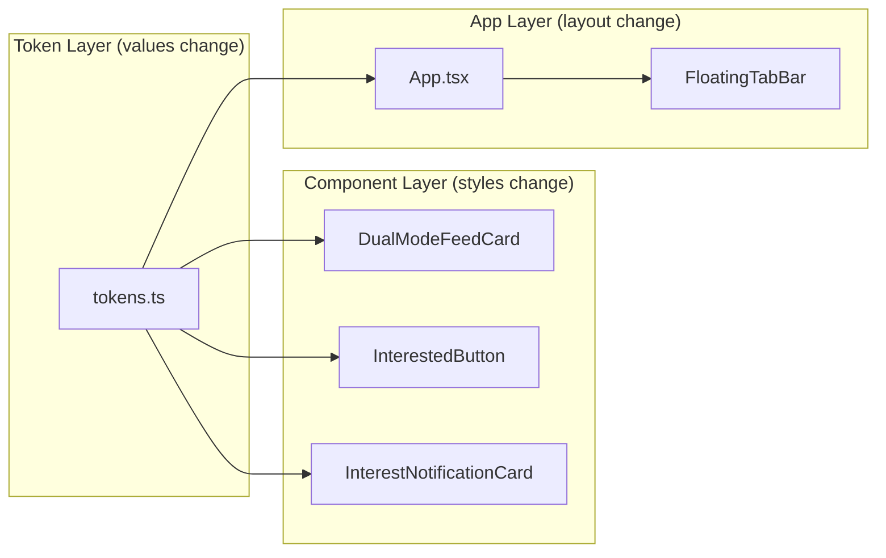

# Design Document: Earthy UI Redesign

## Overview

This design covers the visual refresh of the NeighborYield app, replacing the current bright green palette with warm, earthy tones in Abundance mode and swapping neon green accents for cool mint in Survival mode. It also introduces a floating bottom tab bar to replace the top navigation tabs, and updates border radii across components for a softer aesthetic.

All changes build on top of the existing dual-mode theme system from the Double Stack UI Overhaul. The token system, ThemeContext, and AnimatedThemeProvider remain structurally unchanged — only token values and component styles are updated.

## Architecture

No new architectural layers are introduced. The changes are scoped to:

1. **Token values** in `src/theme/tokens.ts`
2. **Component styles** in DualModeFeedCard, InterestedButton, InterestNotificationCard
3. **App layout** in `App.tsx` (remove top tabs, add floating bottom tab bar)



## Components and Interfaces

### 1. Updated Design Tokens

The `abundanceTokens` and `survivalTokens` objects in `src/theme/tokens.ts` are updated in-place. No interface changes.

**Abundance token value changes:**

| Token | Old Value | New Value |
|-------|-----------|-----------|
| backgroundPrimary | `#F5F9F5` | `#F5F0E8` |
| backgroundSecondary | `#FFFFFF` | `#FAF7F2` |
| backgroundCard | `#FFFFFF` | `#FFFDF8` |
| backgroundOverlay | `rgba(0,0,0,0.3)` | `rgba(0,0,0,0.3)` (unchanged) |
| textPrimary | `#1A2E1A` | `#2C2C2C` |
| textSecondary | `#4A5D4A` | `#6B6560` |
| textMuted | `#8A9A8A` | `#A09A93` |
| textAccent | `#2E7D32` | `#2D5A3D` |
| accentPrimary | `#4CAF50` | `#2D5A3D` |
| accentSecondary | `#81C784` | `#6B8F71` |
| accentSuccess | `#66BB6A` | `#5A8A5E` |
| accentWarning | `#FFA726` | `#D4943A` |
| accentDanger | `#EF5350` | `#C75B3F` |
| borderDefault | `#E0E8E0` | `#E5DDD3` |
| borderFocus | `#4CAF50` | `#2D5A3D` |
| shadowColor | `rgba(0,0,0,0.1)` | `rgba(0,0,0,0.08)` |

**Survival token value changes:**

| Token | Old Value | New Value |
|-------|-----------|-----------|
| backgroundPrimary | `#0A0F0A` | `#0D1210` |
| backgroundSecondary | `#141A14` | `#121A16` |
| backgroundCard | `#1A221A` | `#161E1A` |
| textAccent | `#00E676` | `#4AEDC4` |
| accentPrimary | `#00E676` | `#4AEDC4` |
| accentSecondary | `#69F0AE` | `#7AF2D4` |
| accentSuccess | `#00E676` | `#4AEDC4` |
| borderDefault | `#2E4A2E` | `#2A3A30` |
| borderFocus | `#00E676` | `#4AEDC4` |
| textMuted | `#66BB6A` | `#4AEDC4` |

### 2. FloatingTabBar Component

```typescript
// New component in App.tsx (inline, not a separate file)

interface FloatingTabBarProps {
  activeScreen: 'feed' | 'create' | 'settings';
  onTabPress: (screen: 'feed' | 'create' | 'settings') => void;
  mode: 'abundance' | 'survival';
}

// Tab configuration:
// - Feed: Newspaper icon from lucide-react-native
// - Share: PlusCircle icon from lucide-react-native
// - Settings: Settings icon from lucide-react-native

// Styling:
// - position: absolute, bottom: 24, alignSelf: center
// - width: ~70% of screen
// - borderRadius: 28
// - background: rgba(45, 90, 61, 0.92) abundance / rgba(13, 18, 16, 0.95) survival
// - shadow: offset(0, 8), blur 32, rgba(0,0,0,0.15)
// - padding: 8 vertical, 6 horizontal
// - Active: white icon + 4px dot below
// - Inactive: white icon at 0.6 opacity
// - Press: scale(0.9) animation via Animated
```

### 3. Updated DualModeFeedCard Styles

```typescript
// Changes to src/components/feed/DualModeFeedCard.tsx

// abundanceModeConfig changes:
// - borderRadius: 16 → 20

// Style changes:
// - categoryBubble borderRadius: 10 → 14
// - riskBadge borderRadius: 6 → 10
```

### 4. Updated InterestedButton Styles

```typescript
// Changes to src/components/feed/InterestedButton.tsx

// Style changes:
// - button borderRadius: 8 → 14
// - button backgroundColor: '#2e7d32' → use tokens.accentPrimary via props or context
```

### 5. Updated InterestNotificationCard Styles

```typescript
// Changes to src/components/interest/InterestNotificationCard.tsx

// Style changes:
// - container borderRadius: 12 → 16
// - button borderRadius: 8 → 12
// - Replace hardcoded colors with token values via useTheme hook
// - container backgroundColor: tokens.backgroundCard
// - borderLeftColor: tokens.accentPrimary
// - userIdentifier color: tokens.accentPrimary
// - acceptButton backgroundColor: tokens.accentPrimary
// - declineButton backgroundColor: tokens.backgroundSecondary
// - declineButton borderColor: tokens.borderDefault
// - message color: tokens.textSecondary
// - timestamp color: tokens.textMuted
// - postTitle color: tokens.textPrimary
```

## Data Models

No new data models. The existing `DesignTokens`, `ColorTokens`, and component prop interfaces remain unchanged.

## Correctness Properties

### Property 1: Abundance Palette Values

*For any* read of the abundanceTokens object, the color values SHALL match the specified earthy palette: backgroundPrimary=`#F5F0E8`, backgroundSecondary=`#FAF7F2`, backgroundCard=`#FFFDF8`, accentPrimary=`#2D5A3D`, accentSecondary=`#6B8F71`, textPrimary=`#2C2C2C`, textSecondary=`#6B6560`, textMuted=`#A09A93`, borderDefault=`#E5DDD3`, accentDanger=`#C75B3F`, accentWarning=`#D4943A`, accentSuccess=`#5A8A5E`, shadowColor=`rgba(0, 0, 0, 0.08)`, textAccent=`#2D5A3D`.

**Validates: Requirements 1.1-1.14**

### Property 2: Survival Palette Values

*For any* read of the survivalTokens object, the accent colors SHALL use cool mint `#4AEDC4` for accentPrimary, textAccent, and borderFocus, and the backgrounds SHALL use `#0D1210` for backgroundPrimary and `#161E1A` for backgroundCard, with borderDefault=`#2A3A30`.

**Validates: Requirements 2.1-2.7**

### Property 3: Feed Card Border Radius By Mode

*For any* DualModeFeedCard rendered in abundance mode, the card border radius SHALL be 20 pixels. In survival mode, the border radius SHALL remain at 4 pixels or less.

**Validates: Requirements 3.1**

### Property 4: Floating Tab Bar Mode Background

*For any* FloatingTabBar rendered in abundance mode, the background color SHALL be `rgba(45, 90, 61, 0.92)`. In survival mode, the background SHALL be `rgba(13, 18, 16, 0.95)`.

**Validates: Requirements 4.3, 4.4**

### Property 5: Floating Tab Bar Active Tab Indicator

*For any* tab in the FloatingTabBar, if the tab is active, it SHALL render with a white icon (opacity 1.0) and a dot indicator. If inactive, it SHALL render with a white icon at opacity 0.6 and no dot indicator.

**Validates: Requirements 4.9, 4.10**

### Property 6: Interest Button Token Adoption

*For any* InterestedButton rendered in the app, the button background color SHALL equal the Design_Token_System accentPrimary value for the current mode, not a hardcoded color.

**Validates: Requirements 5.1**

### Property 7: Interest Notification Card Token Adoption

*For any* InterestNotificationCard rendered in the app, the component SHALL use Design_Token_System color tokens for background, text, border, and button colors matching the current theme mode.

**Validates: Requirements 5.2**

## Error Handling

No new error conditions are introduced. The existing theme system error handling (fallback to defaults on missing tokens) applies.

## Testing Strategy

### Unit Testing

- Verify all abundance token values match the specified earthy palette
- Verify all survival token values match the specified mint palette
- Verify border radius values in mode configs

### Property-Based Testing

Property-based tests will use `fast-check` to verify:
- Token value correctness across both modes
- FloatingTabBar background color matches mode
- Active/inactive tab styling consistency

**Configuration:**
- Minimum 100 iterations per property test
- Test framework: Jest + fast-check
