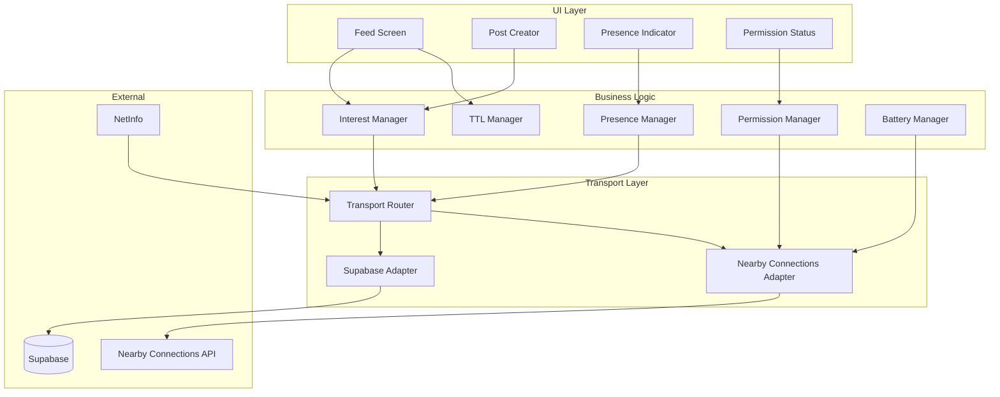
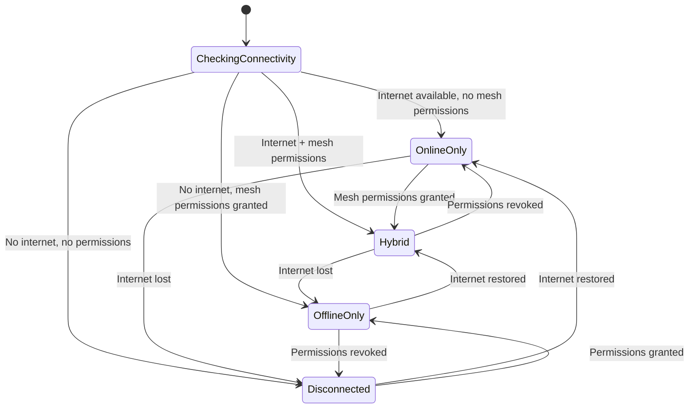

# Design Document: NeighborYield Resilience Edition

## Overview

This design implements a hybrid resilience network for community food sharing using React Native for Android. The architecture enables seamless operation in both online (Supabase) and offline (Google Nearby Connections) modes, with four core subsystems: Interest/Claim Flow, Presence/Heartbeat, TTL Management, and Permission/Battery Management.

The key architectural principle is **transport abstraction**—business logic operates against unified interfaces while transport adapters handle the specifics of Supabase Realtime vs Nearby Connections.

## Architecture



### Connectivity State Machine



## Components and Interfaces

### Transport Router

The Transport Router determines which transport(s) to use based on current connectivity state.

```typescript
interface TransportRouter {
  // Get current connectivity mode
  getMode(): ConnectivityMode;
  
  // Send message via appropriate transport(s)
  send(message: TransportMessage): Promise<SendResult>;
  
  // Subscribe to incoming messages
  subscribe(handler: MessageHandler): Unsubscribe;
  
  // Listen for connectivity changes
  onModeChange(handler: (mode: ConnectivityMode) => void): Unsubscribe;
}

type ConnectivityMode = 'online' | 'offline' | 'hybrid' | 'disconnected';

interface TransportMessage {
  type: MessageType;
  payload: unknown;
  targetEndpoint?: string; // For directed messages
  ttl?: number;
}

type MessageType = 
  | 'share_post'
  | 'interest_ack'
  | 'interest_response'
  | 'heartbeat'
  | 'peer_discovery';
```

### Interest Manager

Handles the claim/interest flow for share posts.

```typescript
interface InterestManager {
  // Express interest in a post
  expressInterest(postId: string): Promise<InterestResult>;
  
  // Respond to an interest (as poster)
  respondToInterest(interestId: string, response: InterestResponse): Promise<void>;
  
  // Subscribe to incoming interests (for posters)
  onInterestReceived(handler: (interest: InterestAck) => void): Unsubscribe;
  
  // Subscribe to responses (for interested parties)
  onResponseReceived(handler: (response: InterestResponse) => void): Unsubscribe;
  
  // Get pending interests for a post
  getPendingInterests(postId: string): InterestAck[];
}

interface InterestResult {
  success: boolean;
  interestId?: string;
  error?: InterestError;
}

type InterestError = 'poster_unreachable' | 'post_expired' | 'already_claimed';
```

### Presence Manager

Manages heartbeat broadcasting and peer discovery.

```typescript
interface PresenceManager {
  // Start/stop presence broadcasting
  startBroadcasting(): void;
  stopBroadcasting(): void;
  
  // Get current peer count
  getPeerCount(): number;
  
  // Get list of active peers
  getActivePeers(): PeerInfo[];
  
  // Subscribe to peer count changes
  onPeerCountChange(handler: (count: number) => void): Unsubscribe;
  
  // Check if presence is active
  isActive(): boolean;
}

interface PeerInfo {
  endpointId: string;
  userIdentifier: string;
  lastSeen: number;
  signalStrength?: number;
}

// Heartbeat payload structure (kept minimal <1KB)
interface HeartbeatPayload {
  v: number;           // Version
  uid: string;         // User identifier (e.g., "Neighbor-A3F9")
  ts: number;          // Timestamp
  cap: number;         // Capabilities bitmask
}
```

### TTL Manager

Handles post expiration and cleanup.

```typescript
interface TTLManager {
  // Register a post for TTL tracking
  trackPost(post: SharePost): void;
  
  // Remove a post from tracking
  untrackPost(postId: string): void;
  
  // Get remaining TTL for a post
  getRemainingTTL(postId: string): number | null;
  
  // Check if post is expired
  isExpired(postId: string): boolean;
  
  // Purge all expired posts
  purgeExpired(): string[]; // Returns purged post IDs
  
  // Subscribe to expiration events
  onPostExpired(handler: (postId: string) => void): Unsubscribe;
  
  // Get TTL for risk tier
  getTTLForRisk(tier: RiskTier): number;
}

type RiskTier = 'high' | 'medium' | 'low';

const TTL_VALUES: Record<RiskTier, number> = {
  high: 15 * 60 * 1000,    // 15 minutes
  medium: 30 * 60 * 1000,  // 30 minutes
  low: 60 * 60 * 1000,     // 60 minutes
};
```

### Permission Manager

Handles Android runtime permissions for mesh functionality.

```typescript
interface PermissionManager {
  // Check all required permissions
  checkPermissions(): Promise<PermissionStatus>;
  
  // Request a specific permission with explanation
  requestPermission(permission: MeshPermission): Promise<PermissionResult>;
  
  // Request all permissions in sequence
  requestAllPermissions(): Promise<PermissionStatus>;
  
  // Subscribe to permission changes
  onPermissionChange(handler: (status: PermissionStatus) => void): Unsubscribe;
  
  // Open system settings for permission
  openSettings(): Promise<void>;
}

type MeshPermission = 'bluetooth' | 'location' | 'nearby_devices';

interface PermissionStatus {
  bluetooth: PermissionState;
  location: PermissionState;
  nearbyDevices: PermissionState;
  canUseMesh: boolean;
}

type PermissionState = 'granted' | 'denied' | 'never_ask_again' | 'unavailable';

interface PermissionResult {
  granted: boolean;
  state: PermissionState;
}
```

### Battery Manager

Manages Nearby Connections lifecycle for battery optimization.

```typescript
interface BatteryManager {
  // App lifecycle hooks
  onAppForeground(): void;
  onAppBackground(): void;
  
  // Background mesh preference
  setBackgroundMeshEnabled(enabled: boolean): void;
  isBackgroundMeshEnabled(): boolean;
  
  // Battery monitoring
  getBatteryLevel(): number;
  isLowBattery(): boolean;
  
  // Subscribe to battery events
  onLowBattery(handler: () => void): Unsubscribe;
  
  // Get current Nearby state
  getNearbyState(): NearbyState;
}

type NearbyState = 'active' | 'suspended' | 'disabled';

interface BatteryConfig {
  foregroundHeartbeatInterval: number;  // 15 seconds
  backgroundHeartbeatInterval: number;  // 60 seconds
  lowBatteryThreshold: number;          // 15%
}
```

### Nearby Connections Adapter

Wraps the Google Nearby Connections API.

```typescript
interface NearbyAdapter {
  // Lifecycle
  start(): Promise<void>;
  stop(): Promise<void>;
  
  // Discovery and advertising
  startAdvertising(serviceId: string): Promise<void>;
  startDiscovery(serviceId: string): Promise<void>;
  stopAdvertising(): void;
  stopDiscovery(): void;
  
  // Connections
  requestConnection(endpointId: string): Promise<void>;
  acceptConnection(endpointId: string): Promise<void>;
  rejectConnection(endpointId: string): void;
  disconnectFromEndpoint(endpointId: string): void;
  
  // Messaging
  sendPayload(endpointId: string, payload: Uint8Array): Promise<void>;
  broadcastPayload(payload: Uint8Array): Promise<void>;
  
  // Event handlers
  onEndpointFound(handler: (endpoint: DiscoveredEndpoint) => void): Unsubscribe;
  onEndpointLost(handler: (endpointId: string) => void): Unsubscribe;
  onConnectionInitiated(handler: (endpoint: string, info: ConnectionInfo) => void): Unsubscribe;
  onConnectionResult(handler: (endpoint: string, result: ConnectionResult) => void): Unsubscribe;
  onPayloadReceived(handler: (endpoint: string, payload: Uint8Array) => void): Unsubscribe;
}

interface DiscoveredEndpoint {
  endpointId: string;
  serviceId: string;
  endpointName: string;
}
```

### Supabase Adapter

Wraps Supabase client for online operations.

```typescript
interface SupabaseAdapter {
  // Share posts
  createPost(post: Omit<SharePost, 'id'>): Promise<SharePost>;
  getPosts(filters?: PostFilters): Promise<SharePost[]>;
  
  // Interest flow
  sendInterest(postId: string, interest: InterestAck): Promise<void>;
  respondToInterest(interestId: string, response: InterestResponse): Promise<void>;
  
  // Realtime subscriptions
  subscribeToPostsChannel(handler: (post: SharePost) => void): Unsubscribe;
  subscribeToInterestsChannel(userId: string, handler: (interest: InterestAck) => void): Unsubscribe;
  subscribeToResponsesChannel(userId: string, handler: (response: InterestResponse) => void): Unsubscribe;
}
```

## Data Models

### Share Post

```typescript
interface SharePost {
  id: string;
  authorId: string;
  authorIdentifier: string;  // Pseudonymous ID like "Neighbor-A3F9"
  title: string;
  description: string;
  riskTier: RiskTier;
  createdAt: number;         // Unix timestamp
  expiresAt: number;         // Unix timestamp (createdAt + TTL)
  source: 'local' | 'supabase';
  location?: {
    latitude: number;
    longitude: number;
  };
}
```

### Interest Acknowledgment

```typescript
interface InterestAck {
  id: string;
  postId: string;
  interestedUserId: string;
  interestedUserIdentifier: string;  // "Neighbor-B7C2"
  timestamp: number;
  source: 'local' | 'supabase';
  status: 'pending' | 'accepted' | 'declined';
}
```

### Interest Response

```typescript
interface InterestResponse {
  interestId: string;
  postId: string;
  responderId: string;
  response: 'accepted' | 'declined';
  message?: string;
  timestamp: number;
}
```

### Local State Store

```typescript
interface LocalState {
  // Posts indexed by ID
  posts: Map<string, SharePost>;
  
  // Interests indexed by post ID
  interestsByPost: Map<string, InterestAck[]>;
  
  // My outgoing interests
  myInterests: Map<string, InterestAck>;
  
  // Active peers
  peers: Map<string, PeerInfo>;
  
  // Permission status
  permissions: PermissionStatus;
  
  // Connectivity mode
  connectivityMode: ConnectivityMode;
  
  // User identity
  userIdentifier: string;
  userId: string;
}
```

### Supabase Schema

```sql
-- Share posts table
CREATE TABLE share_posts (
  id UUID PRIMARY KEY DEFAULT gen_random_uuid(),
  author_id UUID NOT NULL,
  author_identifier TEXT NOT NULL,
  title TEXT NOT NULL,
  description TEXT,
  risk_tier TEXT CHECK (risk_tier IN ('high', 'medium', 'low')),
  created_at TIMESTAMPTZ DEFAULT NOW(),
  expires_at TIMESTAMPTZ NOT NULL,
  location GEOGRAPHY(POINT),
  is_active BOOLEAN DEFAULT true
);

-- Interests table
CREATE TABLE interests (
  id UUID PRIMARY KEY DEFAULT gen_random_uuid(),
  post_id UUID REFERENCES share_posts(id),
  interested_user_id UUID NOT NULL,
  interested_user_identifier TEXT NOT NULL,
  status TEXT CHECK (status IN ('pending', 'accepted', 'declined')) DEFAULT 'pending',
  created_at TIMESTAMPTZ DEFAULT NOW()
);

-- Enable realtime
ALTER PUBLICATION supabase_realtime ADD TABLE share_posts;
ALTER PUBLICATION supabase_realtime ADD TABLE interests;

-- RLS policies (simplified for MVP)
ALTER TABLE share_posts ENABLE ROW LEVEL SECURITY;
ALTER TABLE interests ENABLE ROW LEVEL SECURITY;
```


## Correctness Properties

*A property is a characteristic or behavior that should hold true across all valid executions of a system—essentially, a formal statement about what the system should do. Properties serve as the bridge between human-readable specifications and machine-verifiable correctness guarantees.*

### Property 1: Transport Routing by Connectivity Mode

*For any* message transmission request and connectivity mode, the Transport Router SHALL route messages through the correct transport adapter: Supabase for online mode, Nearby Connections for offline mode, and both for hybrid mode.

**Validates: Requirements 1.2, 1.3, 2.2, 2.3**

### Property 2: Interest Creation Completeness

*For any* valid share post and user action to express interest, the Interest Manager SHALL create an InterestAck containing the correct postId, interestedUserId, interestedUserIdentifier, timestamp, and pending status.

**Validates: Requirements 1.1**

### Property 3: Interest Queue Accumulation

*For any* sequence of interest expressions on a single post, the Interest Manager SHALL maintain all interests in the queue such that getPendingInterests returns all accumulated interests without loss or replacement.

**Validates: Requirements 1.5**

### Property 4: Retry Behavior on Unreachable Endpoint

*For any* interest transmission to an unreachable endpoint in offline mode, the Interest Manager SHALL perform non-blocking retries and eventually return an InterestError of 'poster_unreachable' without blocking the UI thread.

**Validates: Requirements 1.6**

### Property 5: Bidirectional Channel Establishment

*For any* received InterestAck, the Communication Channel SHALL establish a bidirectional connection that allows both parties to send and receive messages.

**Validates: Requirements 2.1**

### Property 6: Response Delivery Guarantee

*For any* InterestResponse sent by a poster, the Communication Channel SHALL deliver the response to the interested user's device (subject to connectivity).

**Validates: Requirements 2.4**

### Property 7: Heartbeat Broadcasting on Mode Transition

*For any* transition to offline or hybrid connectivity mode, the Presence Manager SHALL begin broadcasting heartbeat messages via Nearby Connections.

**Validates: Requirements 3.1**

### Property 8: Peer List Addition on Heartbeat

*For any* heartbeat received from a nearby device, the Presence Manager SHALL add or update that device in the active peer list with correct endpointId, userIdentifier, and lastSeen timestamp.

**Validates: Requirements 3.2**

### Property 9: Peer Timeout Removal

*For any* peer in the active list that has not sent a heartbeat for 2 consecutive intervals (30 seconds), the Presence Manager SHALL remove that peer from the active list.

**Validates: Requirements 3.3**

### Property 10: Heartbeat Payload Size Constraint

*For any* heartbeat payload serialization, the resulting byte array SHALL be less than 1024 bytes (1KB).

**Validates: Requirements 3.4**

### Property 11: Peer Count Display Format

*For any* peer count N >= 1, the UI SHALL display the string "N neighbors in range" where N is the exact count. For N = 0, the UI SHALL display "No neighbors in range".

**Validates: Requirements 3.6, 4.2**

### Property 12: Online-Only Mode Indicator

*For any* app state where connectivity mode is 'online', the Presence Indicator SHALL display "Online mode" or be hidden.

**Validates: Requirements 4.4**

### Property 13: Default TTL Assignment

*For any* share post created without explicit risk tier, the TTL Manager SHALL assign a default TTL of 30 minutes (1,800,000 milliseconds).

**Validates: Requirements 5.1**

### Property 14: Expired Post Removal

*For any* share post where current time exceeds expiresAt timestamp, the TTL Manager SHALL exclude that post from the local feed and purgeExpired SHALL return its ID.

**Validates: Requirements 5.2**

### Property 15: TTL by Risk Tier

*For any* risk tier selection, the TTL Manager SHALL assign the correct TTL: high → 15 minutes, medium → 30 minutes, low → 60 minutes.

**Validates: Requirements 5.3, 6.2, 6.3, 6.4**

### Property 16: Relative Time Display

*For any* share post with createdAt timestamp, the UI SHALL display a "posted X min ago" string where X is the floor of (currentTime - createdAt) / 60000.

**Validates: Requirements 5.4**

### Property 17: Expiring Post Warning

*For any* share post with remaining TTL less than 5 minutes (300,000 milliseconds), the UI SHALL display a visual warning indicator.

**Validates: Requirements 5.5**

### Property 18: Purge on App Resume

*For any* app resume from background, the TTL Manager SHALL immediately purge all posts where expiresAt < currentTime, leaving no expired posts in local state.

**Validates: Requirements 5.6**

### Property 19: Permission Explanation Before Request

*For any* permission that is not granted, the Permission Manager SHALL display an explanatory screen before invoking the system permission request dialog.

**Validates: Requirements 7.2**

### Property 20: Full Mesh Enablement

*For any* permission status where bluetooth, location, and nearbyDevices are all 'granted', the canUseMesh flag SHALL be true.

**Validates: Requirements 7.6**

### Property 21: Permission Status Visualization

*For any* permission state (granted, denied, never_ask_again), the Permission Status UI SHALL display the corresponding icon and, for denied states, show a warning with reduced functionality explanation.

**Validates: Requirements 8.1, 8.2**

### Property 22: Background Nearby Suspension

*For any* app transition to background (without Background Mesh enabled), the Battery Manager SHALL stop Nearby Connections advertising and discovery.

**Validates: Requirements 9.1**

### Property 23: Background Mesh Reduced Frequency

*For any* app in background with Background Mesh enabled, the Presence Manager SHALL use 60-second heartbeat intervals instead of 15-second intervals.

**Validates: Requirements 9.3**

### Property 24: P2P Cluster Strategy

*For any* Nearby Connections initialization, the Nearby Adapter SHALL use STRATEGY_P2P_CLUSTER.

**Validates: Requirements 9.4**

### Property 25: Low Battery Mesh Disable

*For any* battery level below 15%, the Battery Manager SHALL disable background mesh and set getNearbyState to 'disabled' or 'suspended'.

**Validates: Requirements 9.5**

### Property 26: Graceful Degradation to Online-Only

*For any* permission status where bluetooth OR location is denied, the connectivity mode SHALL be 'online' (if internet available) and canUseMesh SHALL be false.

**Validates: Requirements 10.1, 10.2**

### Property 27: Online Fallback with Denied Permissions

*For any* state where all mesh permissions are denied but internet is available, the app SHALL function via Supabase with connectivity mode 'online'.

**Validates: Requirements 10.3**

### Property 28: Disconnected State Notice

*For any* state where all mesh permissions are denied AND internet is unavailable, the app SHALL display an offline notice with instructions.

**Validates: Requirements 10.4**

### Property 29: Dynamic Permission Enablement

*For any* permission state change from denied to granted, the app SHALL enable mesh functionality without requiring restart.

**Validates: Requirements 10.5**

## Error Handling

### Transport Errors

| Error Condition | Handling Strategy |
|----------------|-------------------|
| Supabase connection failure | Fall back to offline mode if mesh available; queue messages for retry |
| Nearby Connections unavailable | Fall back to online mode if internet available |
| Payload transmission failure | Retry with exponential backoff (max 3 attempts) |
| Endpoint disconnection | Remove from peer list; attempt reconnection if conversation active |

### Permission Errors

| Error Condition | Handling Strategy |
|----------------|-------------------|
| Permission denied | Display explanation; offer to open settings; degrade gracefully |
| Permission revoked mid-session | Transition to appropriate mode; notify user |
| System Bluetooth disabled | Prompt user to enable; continue in online-only mode |

### TTL Errors

| Error Condition | Handling Strategy |
|----------------|-------------------|
| Invalid TTL value | Default to medium risk (30 minutes) |
| Clock skew detected | Use server time for online posts; accept local time for offline |
| Purge during active view | Remove from list with animation; show toast notification |

### Interest Flow Errors

| Error Condition | Handling Strategy |
|----------------|-------------------|
| Poster unreachable | Retry for 30 seconds; notify user of failure |
| Post expired during interest | Return 'post_expired' error; remove from feed |
| Duplicate interest | Idempotent handling; update timestamp only |

## Testing Strategy

### Unit Testing

Unit tests focus on specific examples, edge cases, and error conditions:

- **Transport Router**: Test mode detection logic, transport selection
- **TTL Manager**: Test expiration calculations, risk tier mapping
- **Permission Manager**: Test state transitions, explanation content
- **Heartbeat Serialization**: Test payload structure, size constraints
- **Interest Manager**: Test interest creation, queue management

### Property-Based Testing

Property tests verify universal properties across randomized inputs. Use `fast-check` for React Native/TypeScript.

**Configuration**:
- Minimum 100 iterations per property test
- Tag format: `Feature: neighbor-yield-resilience, Property N: [property text]`

**Key Properties to Test**:

1. **Transport Routing** (Property 1): Generate random connectivity modes and verify correct adapter selection
2. **Interest Queue** (Property 3): Generate random sequences of interests and verify accumulation
3. **Peer Timeout** (Property 9): Generate random heartbeat sequences with gaps and verify removal
4. **Heartbeat Size** (Property 10): Generate random heartbeat payloads and verify <1KB
5. **TTL by Risk** (Property 15): Generate all risk tiers and verify correct TTL assignment
6. **Expired Post Removal** (Property 14): Generate posts with various timestamps and verify expiration logic
7. **Permission State** (Property 20): Generate all permission combinations and verify canUseMesh flag
8. **Graceful Degradation** (Property 26): Generate permission states and verify mode selection

### Integration Testing

- **End-to-end interest flow**: Create post → Express interest → Receive notification → Respond
- **Mode switching**: Online → Offline → Hybrid transitions with active conversations
- **Permission flow**: First launch → Request sequence → Grant/deny combinations
- **TTL lifecycle**: Create post → Display countdown → Auto-expire → Purge

### Manual Testing Checklist

- [ ] Verify "X neighbors in range" updates in real-time
- [ ] Verify interest notification appears on poster's device
- [ ] Verify expired posts disappear from feed
- [ ] Verify permission explanations are clear and accurate
- [ ] Verify app functions in airplane mode with Bluetooth enabled
