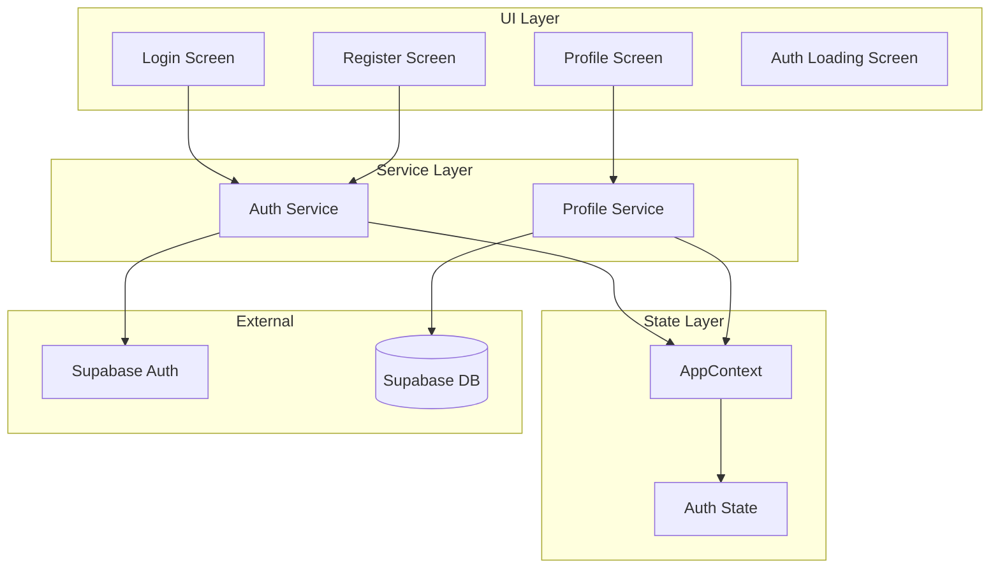

# Design Document

## Overview

This design implements user authentication for the NeighborYield React Native app using Supabase Auth. The architecture integrates with the existing AppContext state management pattern and provides a clean separation between auth UI, auth service logic, and state management.

The key design principles are:
1. **Supabase-first**: Leverage Supabase Auth for all authentication operations
2. **Context integration**: Extend existing AppContext rather than creating separate auth context
3. **Minimal UI**: Simple, focused screens for login, register, and profile
4. **Graceful degradation**: Handle network failures and session expiration smoothly

## Architecture



## Components and Interfaces

### Auth Service

The central service handling all authentication operations.

```typescript
interface AuthService {
  // Session management
  initialize(): Promise<void>;
  getSession(): Promise<Session | null>;
  
  // Authentication
  signUp(email: string, password: string, displayName: string): Promise<AuthResult>;
  signIn(email: string, password: string): Promise<AuthResult>;
  signOut(): Promise<void>;
  
  // Session listeners
  onAuthStateChange(callback: (session: Session | null) => void): () => void;
}

interface AuthResult {
  success: boolean;
  user?: User;
  error?: AuthError;
}

interface AuthError {
  code: 'invalid_credentials' | 'email_taken' | 'weak_password' | 'network_error' | 'unknown';
  message: string;
}
```

### Profile Service

Handles user profile CRUD operations.

```typescript
interface ProfileService {
  getProfile(userId: string): Promise<UserProfile | null>;
  createProfile(userId: string, displayName: string): Promise<UserProfile>;
  updateProfile(userId: string, updates: Partial<UserProfile>): Promise<UserProfile>;
}

interface UserProfile {
  id: string;
  userId: string;
  displayName: string;
  email: string;
  createdAt: number;
  updatedAt: number;
}
```

### Validation Utilities

Pure functions for input validation.

```typescript
interface ValidationResult {
  isValid: boolean;
  error?: string;
}

function validateEmail(email: string): ValidationResult;
function validatePassword(password: string): ValidationResult;
function validateDisplayName(displayName: string): ValidationResult;
function validatePasswordMatch(password: string, confirmPassword: string): ValidationResult;
```

### Extended AppContext

Auth-related additions to existing AppContext.

```typescript
// New state fields
interface AuthState {
  isAuthenticated: boolean;
  isAuthLoading: boolean;
  user: AuthUser | null;
}

interface AuthUser {
  id: string;
  email: string;
  displayName: string;
}

// New actions
type AuthAction =
  | { type: 'SET_AUTH_LOADING'; payload: boolean }
  | { type: 'SET_AUTH_USER'; payload: AuthUser | null }
  | { type: 'CLEAR_AUTH' };

// New context methods
interface AuthContextMethods {
  setAuthLoading: (loading: boolean) => void;
  setAuthUser: (user: AuthUser | null) => void;
  clearAuth: () => void;
}
```

### Screen Components

```typescript
// Login Screen
interface LoginScreenProps {
  onLoginSuccess: () => void;
  onNavigateToRegister: () => void;
}

// Register Screen
interface RegisterScreenProps {
  onRegisterSuccess: () => void;
  onNavigateToLogin: () => void;
}

// Profile Screen
interface ProfileScreenProps {
  onLogout: () => void;
}
```

## Data Models

### Supabase Schema

```sql
-- User profiles table (extends Supabase auth.users)
CREATE TABLE public.user_profiles (
  id UUID PRIMARY KEY DEFAULT gen_random_uuid(),
  user_id UUID REFERENCES auth.users(id) ON DELETE CASCADE NOT NULL UNIQUE,
  display_name TEXT NOT NULL CHECK (char_length(display_name) >= 2 AND char_length(display_name) <= 30),
  created_at TIMESTAMPTZ DEFAULT NOW() NOT NULL,
  updated_at TIMESTAMPTZ DEFAULT NOW() NOT NULL
);

-- Enable RLS
ALTER TABLE public.user_profiles ENABLE ROW LEVEL SECURITY;

-- Users can read any profile (for displaying names on posts)
CREATE POLICY "Profiles are viewable by everyone" ON public.user_profiles
  FOR SELECT USING (true);

-- Users can only update their own profile
CREATE POLICY "Users can update own profile" ON public.user_profiles
  FOR UPDATE USING (auth.uid() = user_id);

-- Users can insert their own profile
CREATE POLICY "Users can insert own profile" ON public.user_profiles
  FOR INSERT WITH CHECK (auth.uid() = user_id);

-- Index for fast lookups
CREATE INDEX idx_user_profiles_user_id ON public.user_profiles(user_id);
```

### TypeScript Types

```typescript
// Auth user from Supabase
interface SupabaseUser {
  id: string;
  email: string;
  created_at: string;
}

// Profile from database
interface UserProfileRow {
  id: string;
  user_id: string;
  display_name: string;
  created_at: string;
  updated_at: string;
}

// Combined user for app state
interface AuthUser {
  id: string;
  email: string;
  displayName: string;
}
```

### Validation Rules

```typescript
const VALIDATION_RULES = {
  email: {
    pattern: /^[^\s@]+@[^\s@]+\.[^\s@]+$/,
    message: 'Please enter a valid email address',
  },
  password: {
    minLength: 6,
    message: 'Password must be at least 6 characters',
  },
  displayName: {
    minLength: 2,
    maxLength: 30,
    message: 'Display name must be 2-30 characters',
  },
};
```


## Correctness Properties

*A property is a characteristic or behavior that should hold true across all valid executions of a system—essentially, a formal statement about what the system should do. Properties serve as the bridge between human-readable specifications and machine-verifiable correctness guarantees.*

### Property 1: Email Validation

*For any* string input, the email validation function SHALL return invalid for strings that do not match the email format pattern (containing @ and domain), and valid for strings that do match.

**Validates: Requirements 1.6, 2.5**

### Property 2: Display Name Validation

*For any* string input, the display name validation function SHALL return invalid for strings with length less than 2 or greater than 30 characters, and valid for strings within that range.

**Validates: Requirements 1.7, 4.4**

### Property 3: Password Mismatch Detection

*For any* two string inputs representing password and confirm password, the validation function SHALL return invalid when the strings are not equal, and valid when they are equal.

**Validates: Requirements 1.5**

### Property 4: Registration Creates Account and Profile

*For any* valid registration data (valid email, password, display name), successful registration SHALL result in both a Supabase Auth account creation and a corresponding user profile record with the provided display name.

**Validates: Requirements 1.2, 1.3**

### Property 5: Login Updates Auth State

*For any* valid credentials, successful login SHALL result in the session being stored and AppContext being updated with the authenticated user's information (id, email, displayName).

**Validates: Requirements 2.2, 2.3**

### Property 6: Session Restoration

*For any* valid existing session found on app launch, the Auth_Service SHALL restore the authenticated state and load the corresponding user profile into AppContext.

**Validates: Requirements 3.2**

### Property 7: Expired Session Refresh

*For any* expired session detected, the Auth_Service SHALL attempt to refresh the session before clearing auth state.

**Validates: Requirements 3.3**

### Property 8: Profile Update Propagation

*For any* valid display name update, successful profile update SHALL result in both the Supabase profile record being updated and AppContext reflecting the new display name.

**Validates: Requirements 4.2, 4.3**

### Property 9: Logout Clears State

*For any* logout action, the Auth_Service SHALL sign out via Supabase Auth and clear all auth-related state from AppContext (isAuthenticated = false, user = null).

**Validates: Requirements 5.1, 5.2**

### Property 10: Posts Display Author Name

*For any* share post with an authenticated author, the post SHALL display the author's display name from their profile, and when creating a post, the system SHALL attach the current user's display name from AppContext.

**Validates: Requirements 6.1, 6.3**

### Property 11: Interests Display User Name

*For any* interest notification, the UI SHALL display the interested user's display name, and when expressing interest, the system SHALL attach the current user's display name from AppContext.

**Validates: Requirements 6.2, 6.4**

### Property 12: Navigation Guard - Unauthenticated Access

*For any* navigation attempt to protected routes while unauthenticated (isAuthenticated = false, isAuthLoading = false), the Navigation_System SHALL redirect to the Login screen.

**Validates: Requirements 8.1**

### Property 13: Navigation Guard - Authenticated Access to Auth Screens

*For any* navigation attempt to Login or Register screens while authenticated (isAuthenticated = true), the Navigation_System SHALL redirect to the main app.

**Validates: Requirements 8.2**

### Property 14: Context Re-render on Auth Change

*For any* change to auth state (isAuthenticated, user), all components consuming AppContext SHALL receive the updated state and re-render accordingly.

**Validates: Requirements 7.2**

## Error Handling

| Error Condition | Handling Strategy |
|----------------|-------------------|
| Invalid email format | Display inline validation error, prevent form submission |
| Invalid password (too short) | Display inline validation error, prevent form submission |
| Password mismatch | Display inline validation error, prevent form submission |
| Invalid display name length | Display inline validation error, prevent form submission |
| Email already registered | Display error message from Supabase, suggest login instead |
| Invalid credentials on login | Display generic "Invalid email or password" message |
| Network error during auth | Display "Network error, please try again" with retry option |
| Session expired | Attempt silent refresh, redirect to login if refresh fails |
| Profile fetch failure | Use cached display name if available, show placeholder otherwise |
| Profile update failure | Display error message, preserve form state for retry |
| Logout failure | Clear local state anyway, navigate to login (graceful degradation) |
| Supabase service unavailable | Display "Service temporarily unavailable" with retry option |

### Error Message Guidelines

- Use user-friendly language, avoid technical jargon
- Provide actionable guidance when possible
- Don't expose sensitive information in error messages
- Log detailed errors for debugging, show simplified messages to users

## Testing Strategy

### Dual Testing Approach

This feature requires both unit tests and property-based tests for comprehensive coverage:

- **Unit tests**: Verify specific examples, edge cases, error conditions, and UI rendering
- **Property tests**: Verify universal properties across all valid inputs using fast-check

### Unit Test Coverage

1. **Validation Functions**
   - Email validation with specific valid/invalid examples
   - Password validation edge cases (exactly 6 chars, empty, whitespace)
   - Display name boundary cases (1 char, 2 chars, 30 chars, 31 chars)

2. **Auth Service**
   - Successful registration flow
   - Registration with duplicate email error
   - Successful login flow
   - Login with invalid credentials error
   - Session restoration on app launch
   - Logout success and failure scenarios

3. **Profile Service**
   - Profile creation on registration
   - Profile fetch by user ID
   - Profile update success and failure

4. **UI Components**
   - Login screen renders required fields
   - Register screen renders required fields
   - Profile screen displays user data
   - Error messages display correctly
   - Loading states display correctly

5. **Navigation**
   - Redirect to login when unauthenticated
   - Redirect to main app when authenticated
   - Loading screen during auth check

### Property-Based Test Coverage

Property-based tests will use fast-check (already in package.json) with minimum 100 iterations per test.

Each property test must be tagged with:
**Feature: user-authentication, Property {number}: {property_text}**

1. **Property 1**: Email validation - generate random strings, verify validation result matches email pattern
2. **Property 2**: Display name validation - generate random strings, verify length-based validation
3. **Property 3**: Password mismatch - generate random string pairs, verify equality check
4. **Property 4**: Registration flow - mock Supabase, verify account + profile creation
5. **Property 5**: Login flow - mock Supabase, verify session storage + context update
6. **Property 8**: Profile update - mock Supabase, verify DB update + context update
7. **Property 9**: Logout flow - mock Supabase, verify signOut + state clear

### Test Configuration

```typescript
// Property test configuration
const PROPERTY_TEST_CONFIG = {
  numRuns: 100,
  verbose: true,
};

// Example property test structure
describe('Email Validation', () => {
  it('Property 1: validates email format correctly', () => {
    // Feature: user-authentication, Property 1: Email Validation
    fc.assert(
      fc.property(fc.string(), (input) => {
        const result = validateEmail(input);
        const hasValidFormat = /^[^\s@]+@[^\s@]+\.[^\s@]+$/.test(input);
        return result.isValid === hasValidFormat;
      }),
      PROPERTY_TEST_CONFIG
    );
  });
});
```
